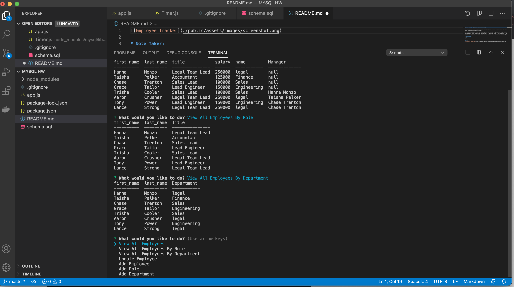

# Employee Tracker:
This application uses databases to store and organize employee information such as first name, last name, role, department and manager. The command line is used to select the function you would like to execute, and then console.table displays the information in a table.

# How to Use:
You will first need to install all the required npm packages using the command line. Once installed, use node to run the app.js file. This will bring up the inquirer prompt with options to select. The first three options will display the employee information based off different filters. The last four options will have follow up questions to update or add information.

# Processes Used:
- express
- mysql
- inquirer
- node.js
- fs

## Usage
[Click here for preview video](https://drive.google.com/file/d/14Z96K5EB4BzSGg9m7-ek4YPWLkrTfqK6/view?usp=sharing)

# Author
- Hanna Munoz
- [Github](https://github.com/hannamunoz)
- [LinkedIn](https://www.linkedin.com/in/hanna-munoz-179993b2/)
